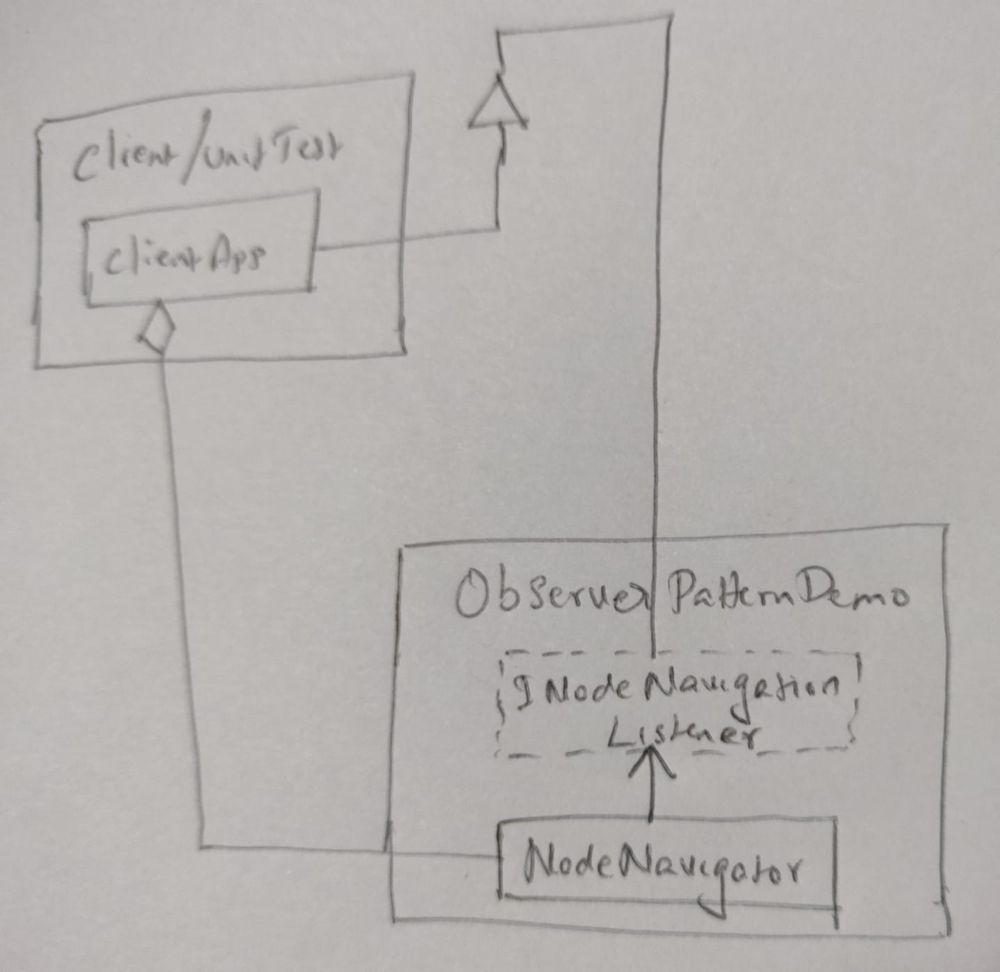

# Overview
**Software design patterns** are programming paradigms that describe reusable patterns for common design problems. They are a set of tried and tested solutions to common problems in software design. They are not algorithms or code snippets that can be copied and pasted into your code. They are more like templates that can be applied to different situations. They are not a substitute for good software design principles, but they are a good starting point for designing your software. They are a good way to document your design decisions. They are a good way to communicate your design to other developers.

**Observer design pattern** is demonstrated in this project. The Observer pattern is a behavioral design pattern that lets you define a subscription mechanism to notify interested clients about any events that happen to the object they're observing. The Observer pattern provides a way to subscribe and unsubscribe to and from these events for any object that implements a subscriber interface. The Observer pattern is also known as the Publish-Subscribe pattern.

**Real world applications** of the Observer pattern include the following: GUI applications, applications involving distributed systems, and applications involving event-driven programming. The Observer pattern is used in
- GUI applications to notify the GUI of changes in the underlying data model.
- Applications involving distributed systems to notify the clients of changes in the underlying data model.
- Applications involving event-driven programming to notify the subscribers of events.

# Design
This project defines a linked list navigator. The navigator is initialized with some data. In real world scenarios, you may think of it as a linked list for say a file system. In this case, it is simply initialized with numbers. As the linked list is being navigated, any interested subscriber is notified when each node is visited; thus demonstrating the observer pattern.

# Environment
The project builds and runs with Visual Studio Community 2022 when the required workloads are installed.
